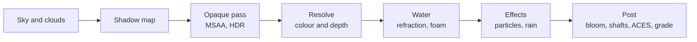

<p align="center">
  <a href="https://halcyon.52-198-144-26.sslip.io/"></a>
</p>

<p align="center">
  <b>A tropical atoll that lives through a day, drawn live in your browser.</b><br>
  Walk the beach, swim the reef, sail the lagoon and fly over the peak, from sunrise to a bioluminescent night.
</p>

<p align="center">
  <a href="https://halcyon.52-198-144-26.sslip.io/"><b>Open the live island</b></a>
  &nbsp;·&nbsp; <a href="#run-it-locally">Run it locally</a>
  &nbsp;·&nbsp; <a href="#how-it-works">How it works</a>
  &nbsp;·&nbsp; <a href="README.zh-CN.md">中文</a>
</p>

<p align="center">
  <a href="https://halcyon.52-198-144-26.sslip.io/"></a>
  <a href="https://threejs.org"></a>
  
  <a href="https://github.com/billpwchan/halcyon/actions/workflows/build.yml"></a>
  <a href="LICENSE"></a>
</p>

<p align="center">
  
</p>

Halcyon is one scene, built to the standard of a game's hero shot and kept at 60 fps on a laptop. Nothing is
pre-rendered. three.js and WebGL2 draw it all, every frame:
- a three-cascade FFT ocean that breaks on the reef;
- a 330 m peak built from real lidar;
- 43,000 scanned plants and 370,000 coral colonies;
- whales, dolphins, turtles and twelve schools of fish;
- a 36-minute day whose weather changes on its own;
- sound synthesised from what is around you.

There is nothing to install: open the link and you are standing on the pier.

<table>
  <tr>
    <td width="50%"><br><sub><b>The atoll.</b> A barrier reef with one pass, five motus, and a lagoon full of coral knolls.</sub></td>
    <td width="50%"><br><sub><b>Pier head, 18:00.</b> The sun and moon track a real latitude, 16.5° south, the latitude of Bora Bora.</sub></td>
  </tr>
  <tr>
    <td><br><sub><b>The reef.</b> Six scanned coral species, each colony with its own levels of detail.</sub></td>
    <td><br><sub><b>The bungalows.</b> The lagoon refracts and glitters. It is the same ocean simulation that runs past the reef.</sub></td>
  </tr>
  <tr>
    <td><br><sub><b>A squall.</b> The weather changes by itself: trade clouds, overcast, rain and thunder.</sub></td>
    <td><br><sub><b>Night.</b> The swash and every wake glow with bioluminescence, under a waxing moon and the stars.</sub></td>
  </tr>
  <tr>
    <td><br><sub><b>Saltwater Village.</b> Palms lean out over the sea, and the shade under them is warm.</sub></td>
    <td><br><sub><b>The lookout.</b> A switchback trail climbs to a shelf 180 m up.</sub></td>
  </tr>
</table>

## What is in it

**The sea**
- An FFT ocean with three cascades of 256², drawn on a CDLOD grid.
- Shore waves come from a jump-flood distance field of the coastline. They shoal over the reef, break, run up the sand as swash and leave it wet.
- A ripple simulation adds the wakes of boats, swimmers and animals.
- Refraction absorbs light along the depth of whatever each pixel actually shows, so knoll edges stay clean.
- Under water there are caustics and light shafts. When you surface, the lens holds drops of water that slide off.

**The island**
- One GPU-generated heightfield (3.6 km across, 2048²) is read back once and then used for walking, placing objects and buoyancy.
- Mount Halcyon is [Ōlomana](https://en.wikipedia.org/wiki/Olomana), from the USGS 1 m lidar survey of O'ahu. It is scaled to 0.68, so its slopes stay true, and turned so that its single-pyramid face looks at the harbour.
- The ground is layered by a vegetation map rather than by height: beach, sandy soil, kept lawn, rank grass, leaf litter only under closed canopy, and triplanar cliffs.

**The plants**
- 24 species, 43,000 instances, all from photoreal scans.
- Full geometry up close with dithered LOD bands, and hemi-octahedral impostors in the distance.
- Shadow-only meshes skip the main pass entirely.

**The reef**
- About 370,000 instanced colonies of six scanned coral species.
- Each colony gets four levels of detail and its own frustum culling.
- Fish schools swim in the vertex shader; the CPU replays the same path to choose each fish's level of detail.

**The life**
- Humpbacks that blow and breach, a dolphin pod, turtles, mantas and blacktip sharks.
- Gulls and frigatebirds overhead, crabs that bolt for the water when you come close, and fireflies after dark.

**The sky and light**
- Single-scattering atmosphere; ray-marched cumulus at half resolution with reprojection; cirrus, stars and a moon with phases.
- Sun and moon follow a real latitude of 16.5° south.
- An HDR pipeline with MSAA; half-resolution GTAO that occludes only sky light and bounce; bloom, sun shafts and ACES.

**The sound**
- Generated live with Web Audio rather than played from loops: surf scaled by your distance to the break, wind, birds by day, crickets by night, rain, and whale song under water.

**The smoothness**
- Every shader is compiled and every texture uploaded before the title fades.
- HD textures stream in over several frames.
- A frame-time governor trades render scale for a steady 60 fps.
- Phones get touch controls and a lighter asset tier.

## Controls

| Input | Action |
|---|---|
| <kbd>1</kbd>–<kbd>5</kbd> | Walk, swim, sail, fly, tour |
| <kbd>W</kbd> <kbd>A</kbd> <kbd>S</kbd> <kbd>D</kbd> / arrows | Move |
| Drag | Look around; double-click to lock the mouse |
| <kbd>Shift</kbd> | Run, swim hard, fly fast |
| <kbd>Space</kbd> / <kbd>C</kbd> | Jump or rise / dive or sink |
| <kbd>[</kbd> <kbd>]</kbd> · <kbd>T</kbd> | Half an hour back or on · pause time |
| <kbd>H</kbd> | Photo mode |
| <kbd>M</kbd> · <kbd>I</kbd> | Sound · about and credits |

## Performance

Measured in Chrome at 1920×1080 on a 2× display (Apple silicon) with the governor on. Each view is a 30 s dwell
while the camera moves.

| View | p50 | p95 | Frames over 20 ms | Render scale |
|---|---|---|---|---|
| Village walk | 16.7 ms | 18.6 ms | 1.1% | 0.65 |
| Peak approach | 16.7 ms | 18.7 ms | 1.7% | 0.56 |
| Aerial orbit | 16.7 ms | 18.6 ms | 0.1% | 0.64 |
| Forest walk | 16.7 ms | 18.6 ms | 0.5% | 0.64 |
| Reef glide | 16.7 ms | 18.7 ms | 3.3% | 0.80 |

The governor lowers the render scale when the 75th-percentile frame time rises above 19.5 ms. It tries a step back up
only after a quiet spell, and it undoes any step that does not help.

## Run it locally

You need Node 20.19+ or 22.12+ and a browser with WebGL2.

```bash
git clone https://github.com/billpwchan/halcyon.git
cd halcyon
npm install
npm run assets   # about 560 MB of models, plants and surfaces, from the v1.0.0 release
npm run dev      # http://127.0.0.1:5280
```

`npm run build` writes a static site to `dist/` that any static host can serve. Serve `.ktx2` files as
`image/ktx2`.

The URL accepts a few parameters:

| Parameter | Effect |
|---|---|
| `?h=17.8` | Start at this hour; add `&run` to let time run |
| `?w=squall` | Fix the weather: `clear`, `trade`, `overcast` or `squall` |
| `?cam=x,y,z&look=x,y,z` | Place the camera, in metres; north is −z |
| `?auto` | Skip the title screen |
| `?noui` | Hide the interface |
| `?scale=0.8` | Lock the render scale |

## How it works



```
src/
  core/      render pipeline, GTAO, post, model loading and HD streaming, GPU helpers
  world/     layout, heightfield, terrain, ocean and its simulation, sky, coral, village, mountain
  veg/       vegetation map, LODs and impostors, grass
  life/      whales, dolphins and the rest; fish schools; particles; fireflies
  env/       sun, moon, time and weather
  player/    walking, swimming, sailing, flying and the tour
  audio/     procedural sound
  ui/        title, dock, photo mode, about panel
scripts/     asset pipelines and the performance harness
docs/        design notes and media
```

The design notes in [docs/DESIGN.md](docs/DESIGN.md) cover each system in more depth and record the measured
performance.

### Rebuilding the assets

`npm run assets` downloads finished assets. To change them, use the pipelines that produced them:

| Script | What it makes | Input |
|---|---|---|
| `scripts/models.mjs` | Animals, boats, buildings and coral as glTF with KTX2, LODs and HD maps | Sketchfab scans saved as `.cache/sf_full/<src>.glb`, where `<src>` is the name in the script's table. Download each `gltf` archive from its page in [CREDITS.md](CREDITS.md) and pack it with `npx gltf-transform copy` |
| `scripts/flora.mjs` | Plant species with atlases, LODs and root balls | Sketchfab plant scans, stored the same way |
| `scripts/massif.mjs` | The mountain's relief on the heightfield grid | USGS GeoTIFFs in `.cache/dem` (see [CREDITS.md](CREDITS.md)) |
| `scripts/textures.mjs` | Ground and wood surfaces as webp | Poly Haven; needs `cwebp` |
| `scripts/perf.mjs` | Frame-time percentiles from a headed browser | A running dev server |

## Credits

- **Models:** Sketchfab artists under CC BY 4.0 and CC0.
- **Surfaces:** Poly Haven (CC0).
- **Terrain:** the U.S. Geological Survey 3D Elevation Program (public domain).
- **Fonts:** Instrument Serif, Inter Tight and Geist Mono (SIL OFL).

Every model and its author is listed in [CREDITS.md](CREDITS.md) and in the About panel inside the scene.

The bar this project set out to clear was [TIDEWATER](https://x.com/dangreenheck/status/2102878170089169235) by Dan
Greenheck. Halcyon is an independent implementation. It shares no code with TIDEWATER and is not affiliated with it.

## License

The source code is under the [MIT License](LICENSE). The models, surfaces, elevation data and fonts keep their own
licenses, listed in [CREDITS.md](CREDITS.md).
