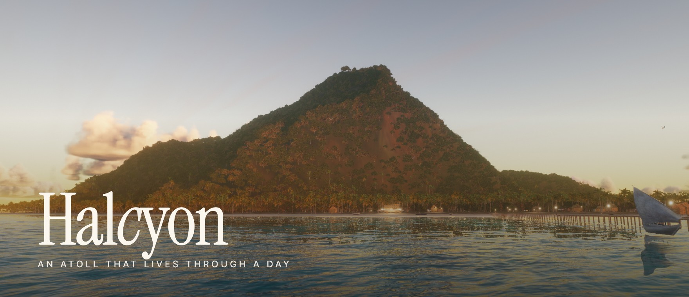
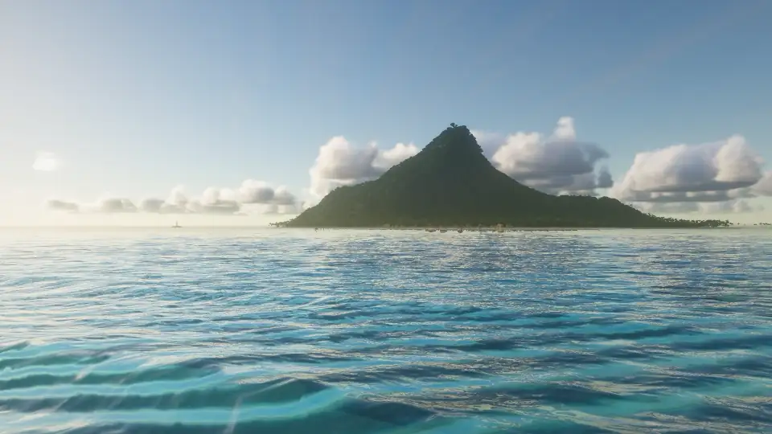
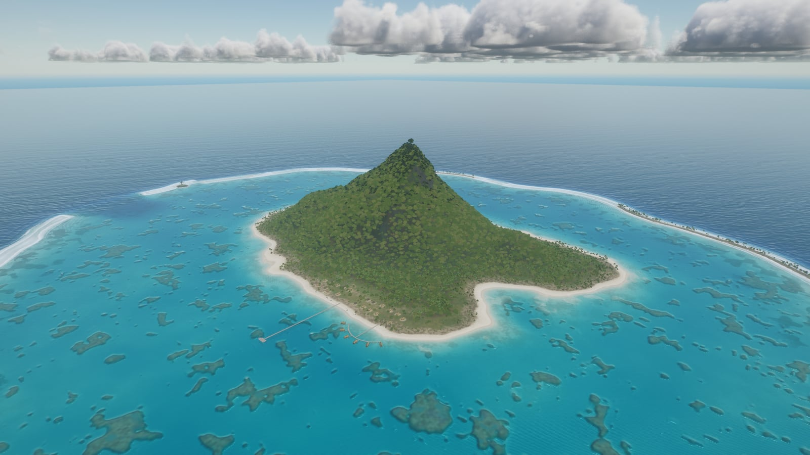
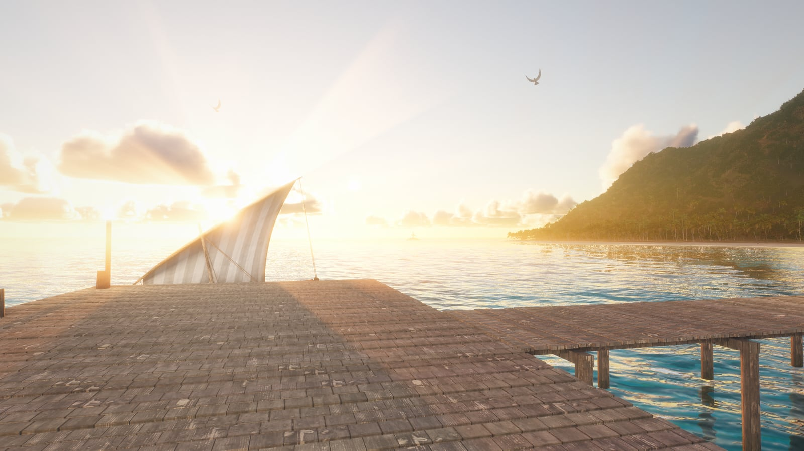
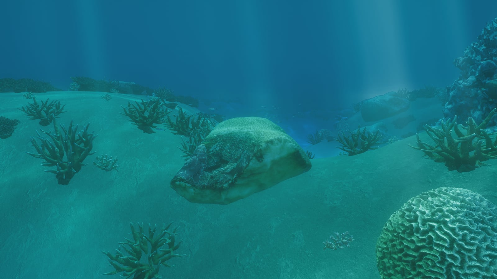
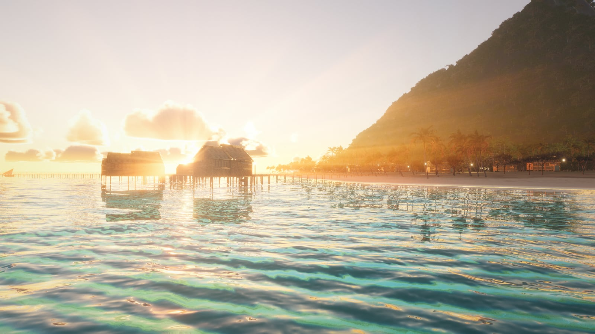
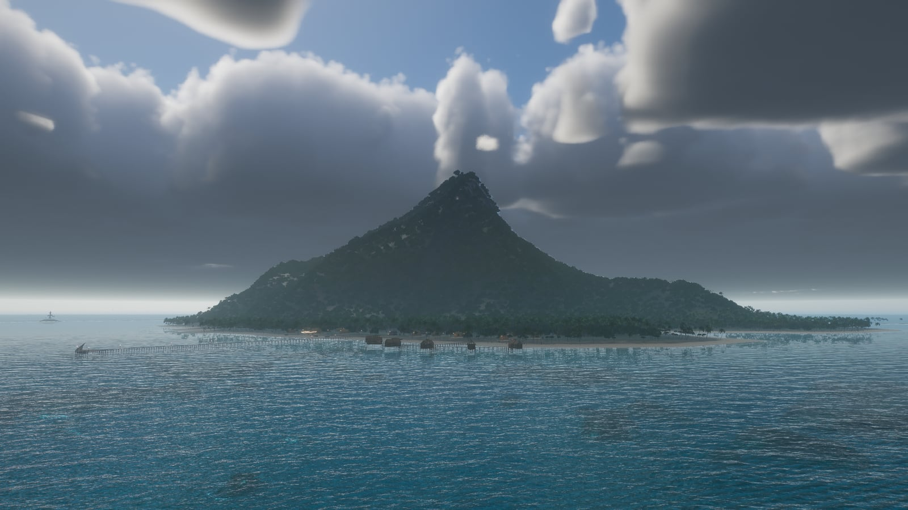
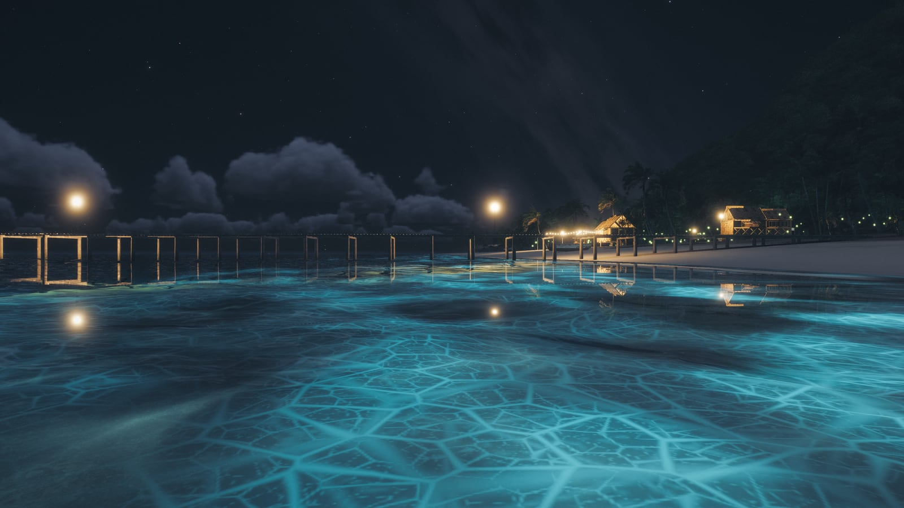
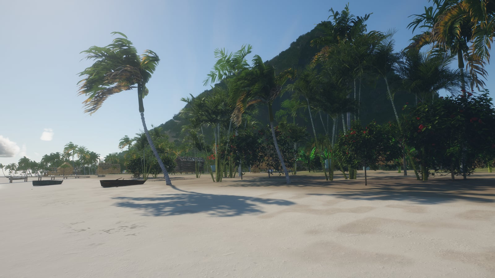
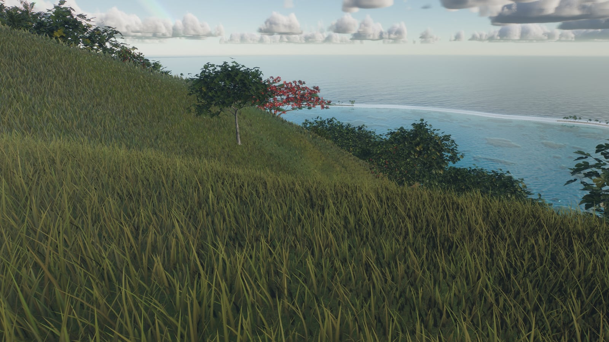

<p align="center">
  <a href="https://halcyon.52-198-144-26.sslip.io/"></a>
</p>

<p align="center">
  <b>一座在浏览器里实时绘制、走完一整天的热带环礁。</b><br>
  在海滩散步，潜入珊瑚礁，驾船穿过潟湖，飞越主峰；从日出一直到海浪发光的夜晚。
</p>

<p align="center">
  <a href="https://halcyon.52-198-144-26.sslip.io/"><b>打开在线演示</b></a>
  &nbsp;·&nbsp; <a href="#本地运行">本地运行</a>
  &nbsp;·&nbsp; <a href="#实现原理">实现原理</a>
  &nbsp;·&nbsp; <a href="README.md">English</a>
</p>

<p align="center">
  <a href="https://halcyon.52-198-144-26.sslip.io/"></a>
  <a href="https://threejs.org"></a>
  
  <a href="https://github.com/billpwchan/halcyon/actions/workflows/build.yml"></a>
  <a href="LICENSE"></a>
</p>

<p align="center">
  
</p>

Halcyon 只做一个场景，按游戏宣传主镜头的标准来打磨，同时在笔记本上稳定 60 fps。整个场景都由 three.js 和 WebGL2 每帧实时绘制，没有任何预渲染画面：
- 三级 FFT 海洋，在礁石上碎成浪；
- 一座用真实激光雷达数据生成的 330 m 主峰；
- 4.3 万株扫描植物、37 万个珊瑚群落；
- 鲸、海豚、海龟和 12 群鱼；
- 36 分钟一轮的昼夜，天气会自己变化；
- 根据你身边环境实时合成的声音。

不用安装任何东西：打开链接，你就站在码头上。

<table>
  <tr>
    <td width="50%"><br><sub><b>环礁。</b>一圈堡礁，一个礁口，五座小沙洲，潟湖里散布着珊瑚丘。</sub></td>
    <td width="50%"><br><sub><b>码头尽头，傍晚 6 点。</b>太阳和月亮按真实纬度运行：南纬 16.5°，与波拉波拉岛相同。</sub></td>
  </tr>
  <tr>
    <td><br><sub><b>珊瑚礁。</b>六种扫描珊瑚，每个群落都有自己的细节层级。</sub></td>
    <td><br><sub><b>水上屋。</b>潟湖的折射和波光，与礁外开阔海面用的是同一套海洋模拟。</sub></td>
  </tr>
  <tr>
    <td><br><sub><b>暴风雨。</b>天气会自己变化：信风积云、阴天、降雨、雷声。</sub></td>
    <td><br><sub><b>夜晚。</b>冲上沙滩的浪和每一道航迹都会发出生物荧光，头顶是上弦后的月亮和星空。</sub></td>
  </tr>
  <tr>
    <td><br><sub><b>咸水村。</b>椰子树斜向海面生长，树荫是暖色的。</sub></td>
    <td><br><sub><b>观景台。</b>之字形山路通到 180 m 高处的一块平台。</sub></td>
  </tr>
</table>

## 里面有什么

**海洋**
- FFT 海洋，三级 256² 频谱，绘制在 CDLOD 网格上。
- 海岸波浪由海岸线的跳跃泛洪（jump flood）距离场驱动：在礁上变浅、破碎、冲上沙滩，留下湿沙。
- 波纹模拟负责船、游泳者和动物留下的航迹。
- 折射按每个像素实际看到的水深计算吸收，所以珊瑚丘边缘不会出现脏边。
- 水下有焦散和光柱；浮出水面时，镜头上会挂着慢慢滑落的水珠。

**岛屿**
- 一张由 GPU 生成的高度场（边长 3.6 km、2048²），只读回一次，之后行走、物体摆放和浮力都用它。
- 主峰 Mount Halcyon 取自欧胡岛的 [Ōlomana](https://en.wikipedia.org/wiki/Olomana)，数据是 USGS 1 m 激光雷达。整体缩放到 0.68，坡度保持真实；转了方向，让它单峰金字塔的那一面朝向港口。
- 地表按植被分布图分层，而不是只看高度：沙滩、沙质土、修剪过的草坪、杂草、只在郁闭林下才有的落叶层，以及三平面映射的崖壁。

**植物**
- 24 个物种，4.3 万个实例，全部来自照片级扫描。
- 近处是带抖动过渡的完整几何体，远处换成半八面体 impostor。
- 只投影的网格完全跳过主渲染通道。

**珊瑚礁**
- 六种扫描珊瑚，约 37 万个实例化群落。
- 每个群落有四级细节和各自的视锥剔除。
- 鱼群在顶点着色器里游动；CPU 重放同一条路径，为每条鱼挑选细节层级。

**生物**
- 会喷水、会跃出海面的座头鲸，一群海豚，海龟、蝠鲼和黑鳍礁鲨。
- 天上有海鸥和军舰鸟；沙滩上的螃蟹见人靠近就逃回水里；入夜有萤火虫。

**天空与光照**
- 单次散射大气；半分辨率光线步进的积云，带重投影；卷云、星空和有盈亏的月亮。
- 太阳和月亮按南纬 16.5° 运行。
- HDR 管线带 MSAA；半分辨率 GTAO，只遮挡天光和反弹光；泛光、太阳光束、ACES 色调映射。

**声音**
- 全部由 Web Audio 实时合成，不是循环播放的音频：海浪声随你到碎浪带的距离变化，还有风声、白天的鸟、夜里的蟋蟀、雨声和水下的鲸歌。

**流畅度**
- 标题淡出前，所有着色器都已编译、所有纹理都已上传。
- 高清纹理分多帧流式加载。
- 帧时间调速器用渲染分辨率换取稳定的 60 fps。
- 手机有触控操作和更轻的素材档。

## 操作

| 输入 | 作用 |
|---|---|
| <kbd>1</kbd>–<kbd>5</kbd> | 步行、游泳、驾船、飞行、游览 |
| <kbd>W</kbd> <kbd>A</kbd> <kbd>S</kbd> <kbd>D</kbd> / 方向键 | 移动 |
| 拖动 | 环顾；双击锁定鼠标 |
| <kbd>Shift</kbd> | 跑步、快游、快飞 |
| <kbd>Space</kbd> / <kbd>C</kbd> | 跳跃或上升 / 下潜或下降 |
| <kbd>[</kbd> <kbd>]</kbd> · <kbd>T</kbd> | 时间后退或前进半小时 · 暂停时间 |
| <kbd>H</kbd> | 拍照模式 |
| <kbd>M</kbd> · <kbd>I</kbd> | 声音 · 关于与致谢 |

## 性能

测试环境：Chrome，1920×1080，2 倍显示（Apple 芯片），调速器开启。每个视角在镜头移动中连续测 30 秒。

| 视角 | p50 | p95 | 超过 20 ms 的帧 | 渲染分辨率 |
|---|---|---|---|---|
| 村庄步行 | 16.7 ms | 17.6 ms | 3.1% | 0.95–1 |
| 飞向主峰 | 16.7 ms | 17.6 ms | 1.3% | 0.9–1 |
| 空中环绕 | 16.7 ms | 17.5 ms | 0% | 1 |
| 林中步行 | 16.7 ms | 17.6 ms | 1.1% | 0.95–1 |
| 掠过珊瑚礁 | 16.7 ms | 17.5 ms | 0% | 0.95–1 |

渲染分辨率 1 就是显示器的原生分辨率，这里是 3840×2160。第 75 百分位帧时间超过 19.5 ms 时，调速器会降低渲染分辨率。着色器编译或纹理上传造成的单帧卡顿会被忽略；稳定一段时间后才会试着调回去，没有帮助的调整会被撤销。低于原生分辨率时，画面用带钳制的 Catmull-Rom 滤波放大，并按比例锐化，在 2 倍屏上依然清晰。

## 本地运行

需要 Node 20.19+ 或 22.12+，以及支持 WebGL2 的浏览器。

```bash
git clone https://github.com/billpwchan/halcyon.git
cd halcyon
npm install
npm run assets   # 约 560 MB 的模型、植物和地表贴图，来自 v1.0.0 Release
npm run dev      # http://127.0.0.1:5280
```

`npm run build` 会在 `dist/` 生成纯静态站点，任何静态托管都能部署。部署时请把 `.ktx2` 文件的类型设为 `image/ktx2`。

URL 支持以下参数：

| 参数 | 作用 |
|---|---|
| `?h=17.8` | 从这个时刻开始；加 `&run` 让时间流动 |
| `?w=squall` | 固定天气：`clear`、`trade`、`overcast` 或 `squall` |
| `?cam=x,y,z&look=x,y,z` | 摆放镜头，单位米；北方是 −z |
| `?auto` | 跳过标题画面 |
| `?noui` | 隐藏界面 |
| `?scale=0.8` | 锁定渲染分辨率 |

## 实现原理

每一帧按顺序执行以下通道（`src/core/pipeline.js`）：
1. **天空与云。** 大气，以及半分辨率光线步进、带重投影的积云。
2. **阴影。** 一张太阳阴影贴图。只投影的网格只在这里绘制。
3. **不透明物体。** 地形、植物、珊瑚礁、村庄和动物，HDR 加 MSAA。
4. **遮蔽与解析。** 先在不透明深度上以半分辨率计算 GTAO，再解析出颜色和深度，供水面看到水下的东西。
5. **水面。** 按深度吸收的折射、反射、泡沫、冲刷浪和航迹。
6. **特效。** 鲸和海豚溅起的水雾、萤火虫和灯塔光束。
7. **后期。** 先做泛光和太阳光束，最后一次合成到屏幕：曝光、ACES、调色、水下光照和镜头水珠。

```
src/
  core/      渲染管线、GTAO、后期、模型加载与高清流式加载、GPU 工具
  world/     布局、高度场、地形、海洋及其模拟、天空、珊瑚、村庄、主峰
  veg/       植被分布、细节层级与 impostor、草
  life/      鲸、海豚等动物，鱼群，粒子，萤火虫
  env/       太阳、月亮、时间与天气
  player/    步行、游泳、驾船、飞行与游览
  audio/     程序化声音
  ui/        标题、控制栏、拍照模式、关于面板
scripts/     素材管线与性能测试工具
docs/        设计笔记与配图
```

[docs/DESIGN.md](docs/DESIGN.md)（英文）逐一讲解各个系统，并附有完整的性能测量记录。

### 重新生成素材

`npm run assets` 下载的是做好的素材。要修改素材，用生成它们的管线脚本：

| 脚本 | 产出 | 输入 |
|---|---|---|
| `scripts/models.mjs` | 动物、船、建筑和珊瑚：带 KTX2、细节层级和高清贴图的 glTF | Sketchfab 扫描模型，存成 `.cache/sf_full/<src>.glb`，`<src>` 是脚本表格里的名字。从 [CREDITS.md](CREDITS.md) 列出的页面下载 `gltf` 压缩包，再用 `npx gltf-transform copy` 打包 |
| `scripts/flora.mjs` | 植物：图集、细节层级和根部土球 | Sketchfab 植物扫描，存放方式同上 |
| `scripts/massif.mjs` | 落到高度场网格上的山体起伏 | `.cache/dem` 中的 USGS GeoTIFF（见 [CREDITS.md](CREDITS.md)） |
| `scripts/textures.mjs` | 地表与木材的 webp 贴图 | Poly Haven；需要 `cwebp` |
| `scripts/perf.mjs` | 有头浏览器下的帧时间百分位 | 正在运行的开发服务器 |

## 致谢

- **模型：** Sketchfab 上的作者，CC BY 4.0 和 CC0 授权。
- **地表：** Poly Haven（CC0）。
- **地形：** 美国地质调查局（USGS）3D Elevation Program，公有领域。
- **字体：** Instrument Serif、Inter Tight 和 Geist Mono（SIL OFL）。

每个模型及其作者都列在 [CREDITS.md](CREDITS.md) 和场景内的“关于”面板里。

这个项目给自己定的标杆是 Dan Greenheck 的 [TIDEWATER](https://x.com/dangreenheck/status/2102878170089169235)。Halcyon 是独立实现，没有使用 TIDEWATER 的任何代码，与它也没有任何关联。

## 许可

源代码采用 [MIT 许可](LICENSE)。模型、地表贴图、高程数据和字体沿用各自的许可，见 [CREDITS.md](CREDITS.md)。
